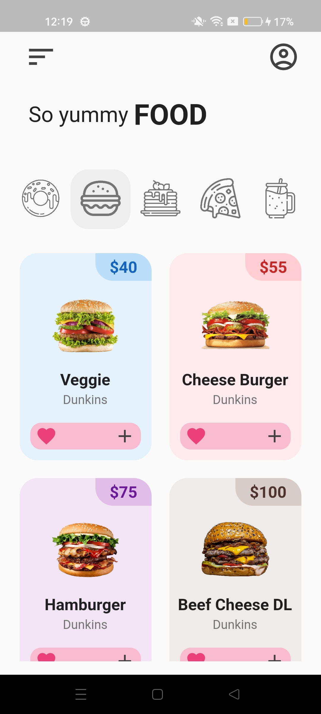

<!-- # Flutter Donut App UI - Design Inspiration

## About this project
- Tab bar with custom design
- Tab bar view custom tile
- Gridview implement

## Preview

   <table>
      <tr>
         <td style="text-align: center">
            
         </td>
         <td style="text-align: center">
            
         </td>
      </tr>
   </table>

-->

# Flutter Donut App UI - Design Inspiration

   <table>
      <tr>
         <td style="text-align: center">
            
         </td>
      </tr>
   </table>

## About This Project

This project showcases a Flutter UI design inspired by a donut-themed mobile application. The design focuses on creating an engaging user interface using Flutter's powerful widgets and components.

The key features of this project include:

- Custom-designed tab bar for seamless navigation.
- Tab bar view with custom tiles for efficient content organization.
- Implementation of a grid view to display a collection of delightful donut images.

This project serves as both a source of design inspiration and a practical example of creating complex UI layouts in Flutter.

<!-- ## Screenshots

 -->

## Getting Started
To run this project locally, follow these steps:

1. Make sure you have Flutter and Dart installed on your machine.
2. Clone this repository: `git clone https://github.com/Omars-dev/flutter-donut-app-ui.git`
3. Navigate to the project directory: `cd flutter-donut-app-ui`
4. Run `flutter pub get` to install the project dependencies.
5. Connect a device or start an emulator.
6. Run `flutter run` to launch the app on your device/emulator.

**Note:** This project is for educational and inspirational purposes. It does not have any real backend functionality and does not connect to external services.

For inquiries, contact [[linked](https://www.linkedin.com/in/omars-dev/)]

